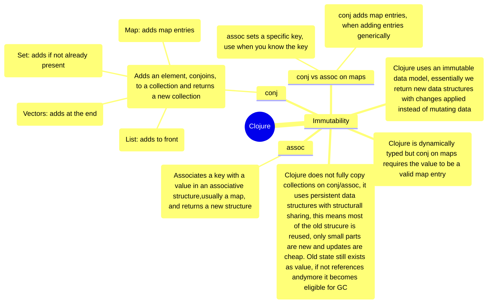

```mermaid
mindmap
  root((Clojure))
    Immutability
        (Clojure uses an immutable data model, essentially we return new data structures with changes applied instead of mutating data)
        assoc
            (Associates a key with a value in an associative structure,usually a map, and returns a new structure)
        conj
            (Adds an element, conjoins, to a collection and returns a new collection)
                (Vectors: adds at the end)
                (List: adds to front)
                (Set: adds if not already present)
                (Map: adds map entries)
        conj vs assoc on maps
            (assoc sets a specific key, use when you know the key)
            (conj adds map entries, when adding entries generically)
        (Clojure is dynamically typed but conj on maps requires the value to be a valid map entry)
        (Clojure does not fully copy collections on conj/assoc, it uses persistent data structures with structurall sharing, this means most of the old strucure is reused, only small parts are new and updates are cheap. Old state still exists as value, if not references andymore it becomes eligible for GC)
```